<p align="center">
  <a href="https://lawsonmode.github.io/voidswarm/"></a>
</p>

<p align="center">
  <b>A neon SubSpace-style arena shooter for 32 pilots. Dogfight, farm the swarm, and bolt yourself onto a teammate to build a flying battle station.</b>
</p>

<p align="center">
  <a href="https://lawsonmode.github.io/voidswarm/"></a>
  
  
  
  <br>
  
  
  
  
  
</p>

<h2 align="center"><a href="https://lawsonmode.github.io/voidswarm/">▶&#xFE0E; PLAY IN YOUR BROWSER</a></h2>

<p align="center">
  <b>Play offline vs bots</b> starts right away: no install, no account, no server.<br>
  Online multiplayer needs someone to host a server (see <a href="#play--host">Play / Host</a>).
</p>

<p align="center">
  <a href="#what-is-voidswarm">About</a> ·
  <a href="#screenshots">Screenshots</a> ·
  <a href="#game-types">Game types</a> ·
  <a href="#classes">Classes</a> ·
  <a href="#turret-stacking--laser-resonance">Turrets</a> ·
  <a href="#loot--the-hangar">Loot</a> ·
  <a href="#controls">Controls</a> ·
  <a href="#soundtrack">Soundtrack</a> ·
  <a href="#play--host">Play / Host</a> ·
  <a href="#moderation">Moderation</a> ·
  <a href="#architecture">Architecture</a> ·
  <a href="#development">Development</a> ·
  <a href="#roadmap">Roadmap</a>
</p>

<p align="center"></p>

## What is Voidswarm?

Voidswarm is a top-down, twin-stick arena shooter that runs in the browser. Its core comes from **SubSpace / Continuum**:

- **Newtonian ships.** You thrust and drift, and you aim independently of where you're flying.
- **Energy is your health and your ammo.** Every shot spends the same bar that keeps you alive, and it recharges all the time. Drop below zero and you're scrap.
- **Bounties.** Every pilot carries a bounty of `10 + 2 × level + 5 × kill streak`. Whoever kills you scores 10 plus your bounty.
- **Turrets.** Warp onto a teammate and ride their hull as a gun. Stack enough pilots on one ship and it becomes a battle station.

On top of that sits a swarm that attacks everybody:

- **Geometry Wars–style swarms** flood the arena and hunt the *nearest ship of any team*, so every PvP fight happens inside a PvE storm. The neon grid warps under every explosion.
- **Vampire Survivors–style progression.** Kills drop XP gems. Each level offers a pick-1-of-3 card while you keep flying (the game never pauses), and auto-weapons such as Orbit Blades and Pulse Nova fire on their own. When you die you keep your upgrades but drop 40% of this level's XP as gems.
- **Diablo-style builds.** There are three classes with four skills each. You pick a build path at level 3 and then a talent every three levels.
- **Cosmetic loot.** Caches drop in the world and you carry them at your own risk. Whatever you get out goes into your Hangar. Loot never changes your stats.

<table>
  <tr>
    <td align="center"><b>32</b><br><sub>pilots per match<br>(humans + bots)</sub></td>
    <td align="center"><b>FFA&nbsp;·&nbsp;2&#8288;–&#8288;8</b><br><sub>teams</sub></td>
    <td align="center"><b>3&nbsp;·&nbsp;7</b><br><sub>game types ·<br>ways to play</sub></td>
    <td align="center"><b>3&nbsp;×&nbsp;3&nbsp;×&nbsp;4</b><br><sub>classes × paths<br>× talents</sub></td>
    <td align="center"><b>65</b><br><sub>cosmetics: 13 starters<br>+ 52 to loot</sub></td>
    <td align="center"><b>0</b><br><sub>image or audio files:<br>it's all drawn and synthesized live</sub></td>
  </tr>
</table>

The same deterministic simulation runs on a Node server for online play and inside the page for offline play against bots. All art, names and music are original. Voidswarm takes ideas from the games above, never their assets (see [Credits](#credits--inspiration)).

<p align="center"></p>

## Screenshots

<table>
  <tr>
    <td width="50%">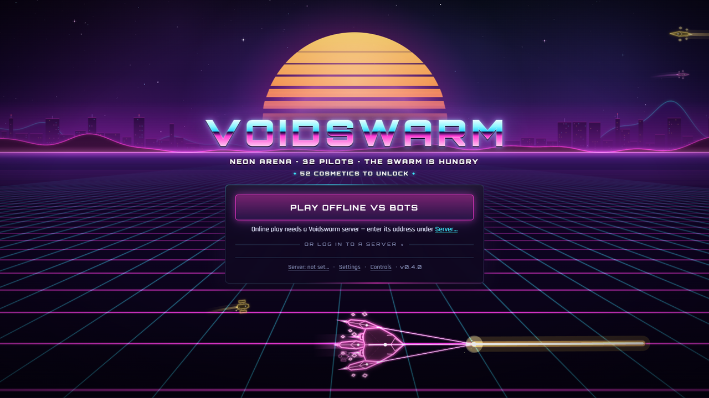<br><sub><b>Title.</b> The attract scene plays live behind the menu: here a Juggernaut carrying three Arcanist lasers fires one resonance lance across the neon floor.</sub></td>
    <td width="50%">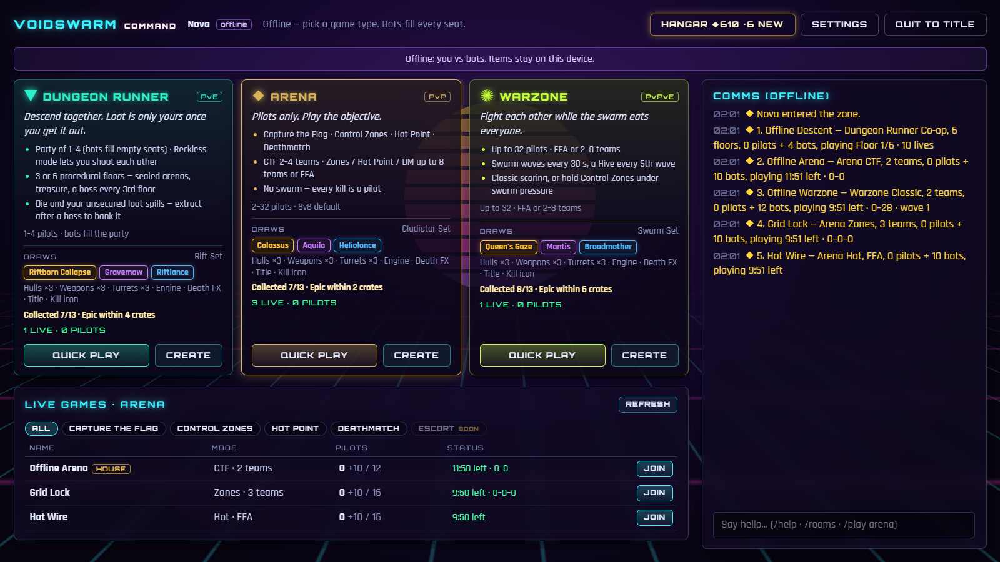<br><sub><b>Command.</b> Three game-type cards with their loot draws, a live games list (Join / Watch), zone chat and the Hangar.</sub></td>
  </tr>
  <tr>
    <td width="50%">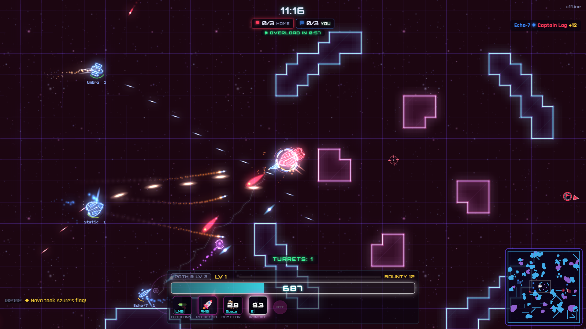<br><sub><b>Arena · Capture the Flag.</b> Running the Azure pennant home, 57 seconds before Flag Overload starts cutting the carrier's recharge.</sub></td>
    <td width="50%">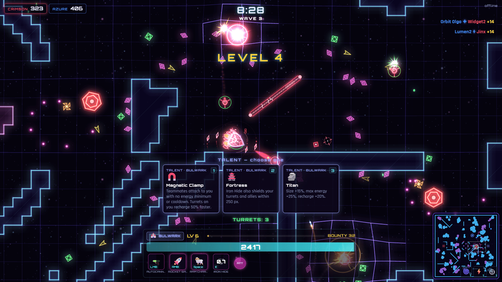<br><sub><b>Warzone · Classic.</b> Wave 3. A Bulwark Juggernaut carries 3 turrets through the swarm while the level-6 talent cards are up.</sub></td>
  </tr>
  <tr>
    <td width="50%">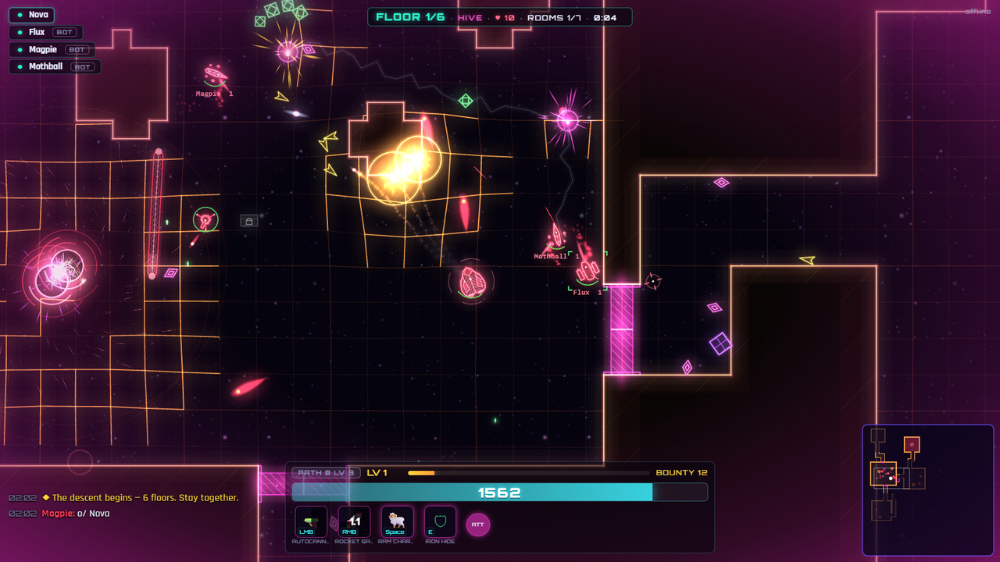<br><sub><b>Dungeon Runner.</b> Floor 1/6 (Hive). The door seals behind the party and nobody leaves until the room is clear.</sub></td>
    <td width="50%">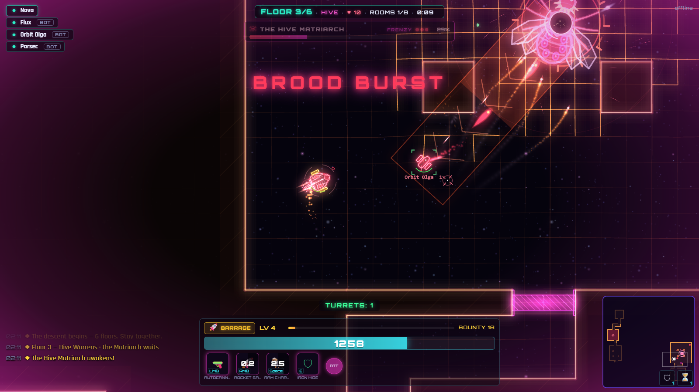<br><sub><b>The Matriarch.</b> Floor 3 boss in Frenzy, with her dash lane telegraphed across the room.</sub></td>
  </tr>
</table>

<p align="center"></p>

## Game types

Pick a card on the **Command** screen. **Quick Play** drops you into the best open game, and bots fill every empty seat. **Create** sets up your own room. **Join** or **Watch** hops into a live game from the list.

| | ▼ **Dungeon Runner** (PvE) | ◆ **Arena** (PvP) | ✺ **Warzone** (PvPvE) |
|---|---|---|---|
| **Pitch** | Descend together. Loot is only yours once you get it out. | Pilots only. Play the objective. | Fight each other while the swarm eats everyone. |
| **Modes** | Co-op Descent | Capture the Flag · Control Zones · Hot Point · Deathmatch | Classic (deathmatch) · Control Zones |
| **Pilots** | Party of 1–4, bots fill the party | 2–32, 8v8 by default | Up to 32 |
| **Teams** | One party | CTF 2–4 · Zones 2–8 · Hot Point / DM 2–8 or FFA | Classic 2–8 or FFA · Zones 2–8 |
| **Length** | Untimed: 3 or 6 floors | 3–20 min | 1–30 min (10 by default) |
| **Swarm** | Story · Veteran · Nightmare | None, every kill is a pilot | Low · Normal · Chaos. Waves every 30 s, a Hive boss every 5th |
| **Drop-in** | At the next floor | Any time | Any time |
| **Exclusive loot** | Rift set | Gladiator set | Swarm set |

### Dungeon Runner: the Rift

- **The floors.** A party of 1–4 descends 3 or 6 procedurally generated floors. Floors 1–3 are the Hive biome and floors 4–6 are Prism. Late joiners drop in at the next floor.
- **Sealed rooms.** Arena, key and boss rooms seal behind you with a force field, and the room stays shut until it's clear.
- **Lives.** The whole party shares one pool of lives, and bot deaths use it up too. Each boss kill adds 2.
- **The Matriarch.** Every 3rd floor ends with her. After the fight you choose: **Extract** and bank your loot, or **Descend** and risk it all.
- **Instability.** Stay on a floor past 7 minutes and it turns unstable: hunter packs start tracking the party.
- **Reckless.** This toggle turns on friendly fire, and a team-kill spills the victim's loot.

<p align="center">
  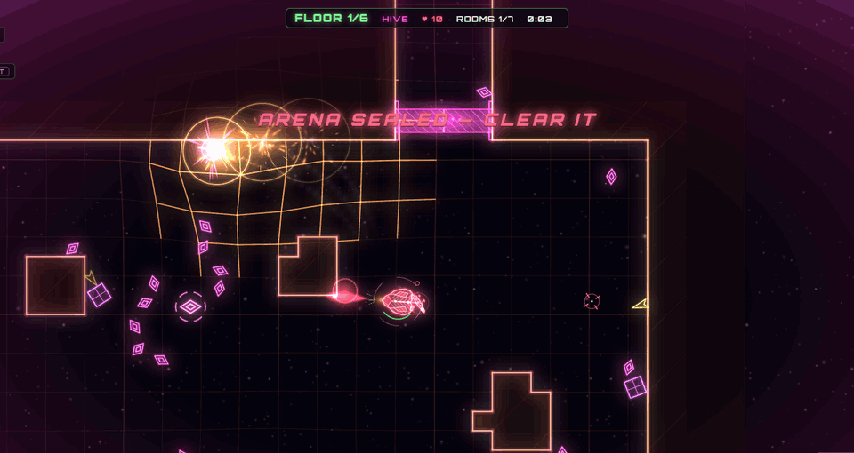
</p>

### Objectives (Arena and Warzone)

- **Capture the Flag** (2–4 teams): steal their pennant and bring it to your stand while yours is home. Carriers fly slower and keep at most one gunner turret. After 60 s of carrying, Flag Overload halves their energy recharge, and at 90 s it cuts recharge off.
- **Control Zones** (2–8 teams): every pad you own ticks points. In Warzone, enough swarmers on a pad freeze its capture.
- **Hot Point** (2–8 teams or FFA): a single pad that moves every 60 s. Only an uncontested holder scores.
- **Deathmatch / Classic:** kills and bounties, plus swarm kills in Warzone.

<details>
<summary><b>The swarm</b> (enemy roster)</summary>

| Enemy | Behavior |
|---|---|
| Drone | Slow homing chaser, the bread and butter of the swarm |
| Dart | Pauses, then dashes in a straight line |
| Weaver | Dodges your shots on the way in |
| Splitter | Splits into 3 splitlings when it dies |
| Spinner | Keeps its distance and fires spirals |
| Black hole | Pulls in ships, gems and shots, grows when fed, and pops violently |
| Brute | Big, slow, lots of HP |
| **Hive** (boss) | Spawns drones and fires rings. Warzone, every 5th wave |
| **Matriarch** (boss) | The Dungeon Runner boss, every 3rd floor |

The swarm spawns out of view, 1000–1500 px away, and never on a team base. Its size scales with the number of players, the swarm setting and the time into the match, up to 350 enemies.
</details>

<p align="center"></p>

## Classes

Each class has four skills, a **turret kit** it uses while attached to a teammate, and **three build paths**.

| | **Juggernaut** | **Arcanist** | **Artificer** |
|---|---|---|---|
| **Archetype** | Brute: physical / melee | Tech: caster / energy | Engineer: support / summoner |
| **Pitch** | A heavily armored bruiser. Smashes through swarms, shrugs off hits, carries turrets. | A fragile caster that bends lightning and gravity. Huge burst, blinks out of trouble. | Builds sentries and walls, heals the team, and makes every turret stack better. |
| **LMB** primary | Autocannon | Plasma Bolt | Rivet Gun |
| **RMB** secondary | Rocket Salvo | Arc Lightning | Deploy Sentry |
| **Space** mobility | Ram Charge | Blink | Repair Pulse |
| **E** utility | Iron Hide | Singularity | Shield Wall |
| **Build paths** | Ram · Barrage · Bulwark | Storm · Void · Lance | Summoner · Medic · Architect |
| **Turret kit** | Flak Mount: Flak Cannon / Brace | Laser Mount: Laser Lance / Deflector | Seeker Pod: Seeker Volley / Hull Weld |
| **Hull** | Largest hull, 1800 energy, 2 turret slots | Smallest and fastest, 1100 energy, 2 turret slots | 1300 energy, 3 turret slots |

**Level-up schedule.** Every level offers a pick-1-of-3 card, and the game never pauses for it.
- **Level 3:** choose your path.
- **Levels 6, 9, 12 and 15:** take one of your path's talents. You'll have all four by level 15, in the order you chose.
- **Every other level:** general cards (4 weapon tweaks, 12 passives and 5 auto-weapons), weighted toward your path.

<p align="center">
  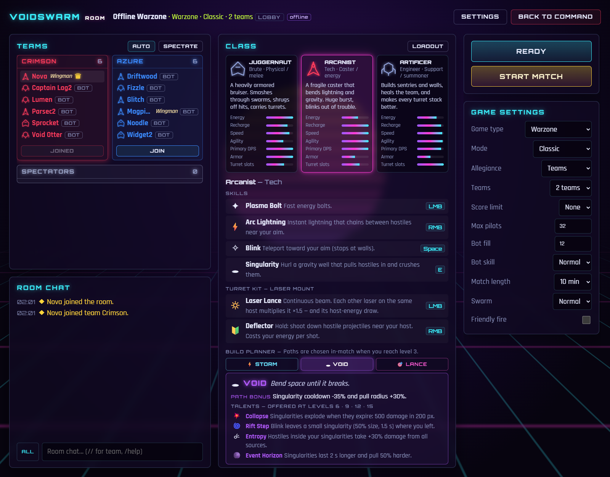
  <br><sub>The room lobby: the class picker with the Arcanist's stats, skills and turret kit, and the build planner on the <b>Void</b> path.</sub>
</p>

<details>
<summary><b>All 9 paths and 36 talents</b></summary>

#### Juggernaut

| Path | Path bonus | Talents |
|---|---|---|
| **Ram**: *Be the battering ram.* | Ram Charge cooldown −40%, damage +50%. Spiked Prow: small swarmers that touch you die, and you take 70% less contact damage. | Shockwave · Momentum · Unstoppable · Reactive Plating |
| **Barrage**: *Fill the sky with fire.* | Rocket Salvo fires +2 rockets, cooldown −20%. | Cluster Rockets · Auto-Launcher · Napalm · Heavy Warheads |
| **Bulwark**: *A fortress others ride into battle.* | +3 turret slots, +35% max energy, turrets on you deal +25% damage. | Fortress · Magnetic Clamp · Reflector · Titan |

#### Arcanist

| Path | Path bonus | Talents |
|---|---|---|
| **Storm**: *Ride the lightning.* | Arc Lightning hits +2 targets, cooldown −25%. | Static Field · Forked Bolts · Thunderclap · Overload |
| **Void**: *Bend space until it breaks.* | Singularity cooldown −35%, pull radius +30%. | Collapse · Rift Step · Entropy · Event Horizon |
| **Lance**: *One shot. Straight through.* | Plasma Bolts pierce +2 targets, fly 25% faster and 30% farther. | Railshot · Focus · Sniper · Capacitor Coils |

#### Artificer

| Path | Path bonus | Talents |
|---|---|---|
| **Summoner**: *An army in your cargo hold.* | +2 max sentries, sentries fire 30% faster. | Drone Wing · Overclocked Sentries · Hardened Frames · Salvage |
| **Medic**: *Nobody dies on your watch.* | Repair Pulse heals 40% more, cooldown −30%. | Repair Beam · Field Revive · Nanite Cloud · Triage |
| **Architect**: *Build the battlefield.* | Shield Wall hp +60%, length +40%, cooldown −25%. | Tesla Wall · Minefield · Reinforced · Turret Bay |

Every number and description lives in [`src/shared/data/ships.ts`](src/shared/data/ships.ts), which is canon.
</details>

<p align="center"></p>

## Turret stacking + laser resonance

In team modes, press **F** (gamepad **Y**) to warp onto a teammate from anywhere on the map: the one under your cursor, or else the nearest. You need at least half your energy, and the host needs a free turret slot. Once you're attached:

- You're locked to the host's hull. You aim freely and recharge 1.5× faster.
- Your skills are replaced by your class's **turret kit**. **LMB** offense spends the **host's** energy and stops when the host drops below 20%. **RMB** defense (hold) spends your own.
- Every turret slows its host by 7%. The host can shake you off (**X** / **B**), you can let go yourself, and if the host dies you're thrown clear.

| Turret kit | LMB offense (host's energy) | RMB defense, hold (your energy) |
|---|---|---|
| Juggernaut: **Flak Mount** | **Flak Cannon**: short-range shotgun bursts | **Brace**: the host takes 50% less damage |
| Arcanist: **Laser Mount** | **Laser Lance**: a continuous hitscan beam | **Deflector**: shoots down hostile projectiles near the host |
| Artificer: **Seeker Pod** | **Seeker Volley**: homing missile volleys | **Hull Weld**: pours your energy into the host |

**Laser resonance.** Every Laser Lance on a host is multiplied by **×1.5 for each other laser firing on that host**, and so is its drain on the host's energy:

| Lasers on one host | Each beam | All beams together | Host energy drain |
|:---:|:---:|:---:|:---:|
| 1 | ×1 | ×1 | ×1 |
| 2 | ×1.5 | ×3 | ×3 |
| 3 | ×2.25 | ×6.75 | ×6.75 |
| 4 | ×3.375 | **×13.5** | **×13.5** |

Four lasers put 13.5 times a single beam's damage down one line, and they drain their host about 1,200 energy a second. So somebody had better be flying a battle-station build: **Bulwark** (+3 slots, +35% energy, +25% turret damage, and Magnetic Clamp lets teammates attach with no energy minimum or cooldown), **Architect** with Turret Bay (+2 slots, +30% turret damage), or the **Turret Mount** card (+1 slot, twice). FFA has no attaching.

<p align="center">
  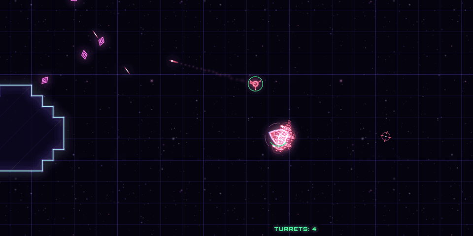
  <br><sub>Four Laser Lances on a Bulwark host: one converged resonance beam (×1.5³ each), drawing 1215 energy a second.</sub>
</p>

<p align="center"></p>

## Loot & the Hangar

Loot in Voidswarm is **cosmetic only**. It never touches stats, hit sizes or damage. Your team colour always stays your outline, your shots and your nameplate, so a legendary never makes you harder to read.

- **7 slots:** hull, weapon and turret per class, plus an engine trail, a death effect, a title and a kill icon shared by all classes.
- **5 rarities:** Common, Uncommon, Rare, Epic, Legendary.
- **65 items:** 13 starters plus 4 sets of 13.
  - **Salvage Line** drops in every mode.
  - **Rift** drops only in Dungeon Runner, **Gladiator** only in Arena, and **Swarm** only in Warzone.
- **Caches** drop in the world:
  - from elites, bosses and shutting down a streak of 3+ kills;
  - from dungeon chests;
  - from flag captures, carrier kills, zone captures and holds, and Hot Point holds.
- **Carrying.** You carry caches **unsecured**: up to 8, or 24 in a rift. Die, leave or switch teams and they **spill**. An enemy who killed you gets first grab for 2 s.
- **Securing.** Caches are banked when the match ends. In a rift they're banked only when you **extract** or the run is cleared. A wipe loses everything you were carrying.
- **Debrief crates** open on the results screen.
  - **Pity:** an Epic is guaranteed within 12 crates and a Legendary within 60.
  - **Duplicates** become shards, worth 5–250 by rarity.
  - Crates and shards need 2 minutes played in a match that ran at least 3.
- **Profiles.**
  - **With an account:** the server rolls every drop with fresh server-side randomness, so a modded client can't predict its crates. It records each grant exactly once, in SQLite.
  - **Guests and offline play:** the profile stays on your device.
- **The Hangar** is where you equip items per class, preview your hull in team colours, track set progress and read each item's drop sources.

<table>
  <tr>
    <td width="50%">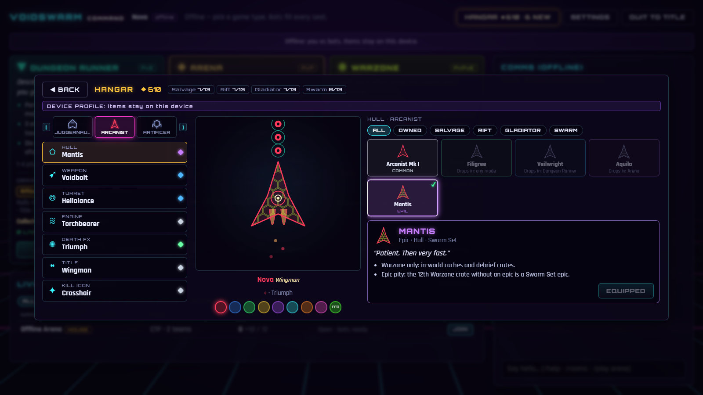<br><sub><b>Hangar.</b> The Arcanist tab with the epic Mantis hull, set progress (Salvage, Rift, Gladiator, Swarm) and 610 shards.</sub></td>
    <td width="50%">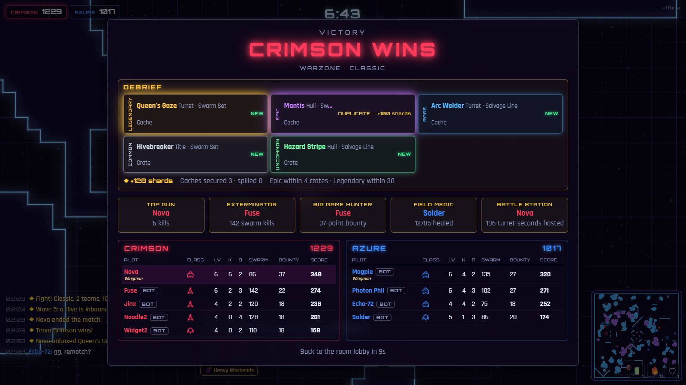<br><sub><b>Debrief.</b> Victory in a 5v5 Warzone: a <b>legendary</b> Queen's Gaze turret, an epic duplicate salvaged for +100 shards, and pity progress.</sub></td>
  </tr>
</table>

<p align="center"></p>

## Controls

Twin-stick and world-relative: WASD (or the arrow keys) thrusts in a direction on screen, and the mouse aims. Gamepads use the standard mapping.

| Action | Mouse + keyboard | Gamepad |
|---|---|---|
| Move (thrust direction) | WASD | Left stick |
| Aim | Mouse | Right stick (at rest: face the move direction) |
| Primary skill · as a turret: **offense** | LMB | RT |
| Secondary skill · as a turret: **defense** (hold) | RMB | RB |
| Utility skill | E | LB |
| Mobility skill | Space | A |
| Afterburner | Shift | LT |
| Attach to a teammate as a turret / detach | F (the teammate under the cursor, else the nearest) | Y |
| Shake off your turrets | X | B |
| Pick level-up card 1 / 2 / 3 | 1 / 2 / 3 | D-pad ← ↑ → |
| Scoreboard | Tab (hold) | View / Back (hold) |
| Big map | M | D-pad ↓ |
| Chat / team chat | Enter / T (or start a line with `//`) | — |
| Menu | Esc | Start |

<p align="center"></p>

## Soundtrack

The score is original synthwave in the style of mid-80s film-score synth rock, a nod to Vince DiCola: arpeggiated 16th-note basslines, detuned pads, gated snares, synth-brass stabs and portamento leads. There are no audio files. A synth, a drum machine and a sequencer written for the game play songs that are stored as data, live in WebAudio. All the tracks share one leitmotif.

| Scene | Track | Key · tempo |
|---|---|---|
| Title | **Voidswarm** (main theme) | D minor · 122 bpm, lifting to E minor |
| Command and room lobbies | **Command Deck** | D dorian · 100 bpm |
| Arena, Warzone and rift floors | **Swarm Protocol** | A minor · 136 bpm |
| Rift boss | **Hive Mother** | E phrygian · 150 bpm |
| Results | **Victory** / **Defeat** stingers | A minor → A major / A minor |

- **Adaptive layers.** Match intensity rises with the wave or floor tier, enemies near you, low energy, overtime and a boss. It brings layers in and out on bar lines.
- **Stingers** mark a wave starting, a boss incoming and your own level-up.
- **Settings:** Music volume and mute. Music goes quiet while the tab is hidden.

<p align="center"></p>

## Play / Host

| | Where | Who can play | What you need |
|---|---|---|---|
| **Offline vs bots** | https://lawsonmode.github.io/voidswarm/ | Anyone with a browser | Nothing |
| **Online, hosted from your PC** | A Cloudflare Tunnel from your PC | Anyone you send the link to, while you host | `cloudflared` (free) |
| **LAN** (classroom / home) | `http://<your-ip>:7777` | Your network | Node 24 |
| **Your own server** | A VPS behind HTTPS/WSS | Anyone | Node 24 + a reverse proxy or tunnel |

### In the browser (GitHub Pages)

- **Play offline vs bots** runs the whole game in your browser, server included.
- **To join an online game,** open **Server…** on the title screen and enter the host's `wss://` address.
  - A link works too, for example `https://lawsonmode.github.io/voidswarm/?server=wss://play.example.com`. You'll be asked to confirm a server that came from a link.
  - An https page can't reach a plain `ws://` server on another machine. From the Pages site, only `ws://localhost` works.
- **Why online needs a host:** GitHub Pages only serves static files, so it can't run the game server (WebSockets plus the accounts and loot database).

### Host online from a Windows PC (Cloudflare quick tunnel)

```powershell
winget install --id Cloudflare.cloudflared                       # once; then open a NEW terminal
powershell -ExecutionPolicy Bypass -File scripts\host-online.ps1  # from the project folder
```

[`scripts/host-online.ps1`](scripts/host-online.ps1) does four things:
1. Builds the game.
2. Opens a free `https://<random>.trycloudflare.com` tunnel.
3. Starts the server bound to `127.0.0.1`, with `TRUST_PROXY=1`, so the tunnel is the only way in.
4. Prints the link to share.

Friends open that link. The page, the game connection and the accounts API all come from one address, so there's nothing to configure. Press **Ctrl+C** to stop.

A quick-tunnel address changes on every run. For a permanent address (a named tunnel on your own domain) and antivirus notes, see **[docs/HOSTING.md](docs/HOSTING.md)**.

### LAN, VPS or any other host

The Node server provides the page, the WebSocket game, the accounts API and the loot database, all on one port:

```bash
npm ci
npm run build && npm start     # game page + ws + accounts API on port 7777
```

- **LAN:** players open `http://<your-ip>:7777`. Plain http/ws is only acceptable on a LAN, so don't reuse real passwords there.
- **Internet:** always put the server behind **HTTPS/WSS**, with `BIND=127.0.0.1` and `TRUST_PROXY=1`.
  - **Caddy** gives you automatic HTTPS: `play.example.com { reverse_proxy 127.0.0.1:7777 }`.
  - **Cloudflare Tunnel** needs no open ports: `cloudflared tunnel --url http://localhost:7777`.
- **Players** either open `https://play.example.com` directly, or use the Pages site and enter `wss://play.example.com` under **Server…**.
- **One process only:** a single Node process owns the SQLite file. Running several processes against it isn't supported.

<details>
<summary><b>Environment variables</b></summary>

| Variable | Default | What it does |
|---|---|---|
| `PORT` | `7777` | Port for the page, the WebSocket and the API. |
| `BIND` | `0.0.0.0` | Listen address. Use `127.0.0.1` when only a local proxy or tunnel should reach the server. |
| `PUBLIC_URL` | `http://localhost:<PORT>` | Your server's https URL, e.g. `https://play.example.com`. Password-reset links point here. |
| `CORS_ORIGINS` | `PUBLIC_URL` + local dev clients | Comma-separated origins allowed to use the accounts API. For the Pages site: `https://play.example.com,https://lawsonmode.github.io`. |
| `TRUST_PROXY` | off | `1` = believe `X-Forwarded-For` from a proxy on loopback / the local network (or listed in `TRUSTED_PROXIES`), so rate limits see each player's real address. |
| `DB_PATH` | `data/voidswarm.db` | SQLite file for accounts, profiles, the loot ledger and the chat log (gitignored). |
| `SMTP_HOST` `SMTP_PORT` `SMTP_USER` `SMTP_PASS` `SMTP_SECURE` `MAIL_FROM` | unset | Password-reset email. Without them, reset links are printed to the server console. See [src/server/auth/README.md](src/server/auth/README.md). |
| `CHAT_FILTER` | `strict` | `strict` (classroom: mild words starred too) or `standard`. |
| `CHAT_LOG_RETENTION_DAYS` | `90` | How long chat lines are kept. |
| `MOD_STRIKE_LIMIT` `MOD_STRIKE_WINDOW_MIN` `MOD_AUTOMUTE_MIN` | `3` · `10` · `10` | Auto-mute: 3 blocked lines in 10 min give a 10 min mute. |
| `WATCH_SAME_NETWORK_BLOCK` | off | `1` refuses Watch from the same network address as a pilot flying that match. It stays off by default because one classroom NAT counts as one address. |
| `MAX_CONNECTIONS` `MAX_CONN_PER_IP` | `512` · `64` | Connection caps. |

</details>

<details>
<summary><b>Accounts</b></summary>

- **Signing up:** register with a username, email and password, then log in with the username (or the email in the same field). The email is used only for password resets.
- **Passwords** are hashed with scrypt. Session and reset tokens are stored hashed, logins are rate-limited per address, and failed logins are locked per account.
- **Guests** can play online but can't use a registered name, and their loot stays on their device.
- **Offline play** never touches accounts.
- Every limit is documented in [src/server/auth/README.md](src/server/auth/README.md).

</details>

<details>
<summary><b>Deploying the Pages site (and forks)</b></summary>

- [`.github/workflows/pages.yml`](.github/workflows/pages.yml) runs on every push to `main`: typecheck, tests (the slow server auth suite is skipped), then `npm run build:pages`, then deploy.
- **One-time setup by the repo owner:** Settings → Pages → Build and deployment → Source: **GitHub Actions**, then re-run the workflow. Until then the link returns 404.
- **To try the Pages build locally,** run `npm run build:pages` and then `npm run preview:pages`, and open http://localhost:4173/voidswarm/.
- **Forks with another repo name,** or any other static host: set `VITE_BASE=/your-path/`.

</details>

<p align="center"></p>

## Moderation

Voidswarm is built so a teacher can host a class, and its defaults are strict.

- **The word filter is always on,** online and offline.
  - It checks every chat line and every name a player picks.
  - It sees through leetspeak, look-alike letters, spacing and invisible characters, and it leaves ordinary words that merely contain a listed term alone.
  - Slurs, hate speech, sexual content, threats and self-harm statements are blocked, and profanity is starred. `CHAT_FILTER=standard` lets mild words through.
- **On a server with accounts** you also get:
  - a chat log (90 days by default);
  - strikes that lead to an automatic mute;
  - bans and mutes by account, guest callsign or network;
  - `/report` for every player, plus chat commands for moderators;
  - the **`/admin`** dashboard, served by the Node server only and never included in the Pages build;
  - a CLI: `npm run mod -- <command>`.

```bash
npm run mod -- promote <your-username>   # the account must exist; a running server picks it up in ~2 s
# then open http://localhost:7777/admin (or your tunnel URL + /admin)
```

Setup, what gets logged, retention, ban scopes and the NAT caveat are covered in **[docs/MODERATION.md](docs/MODERATION.md)**.

<p align="center"></p>

## Architecture

The simulation has two hosts. The same transport-agnostic `Zone` runs either on the Node server or inside the page:

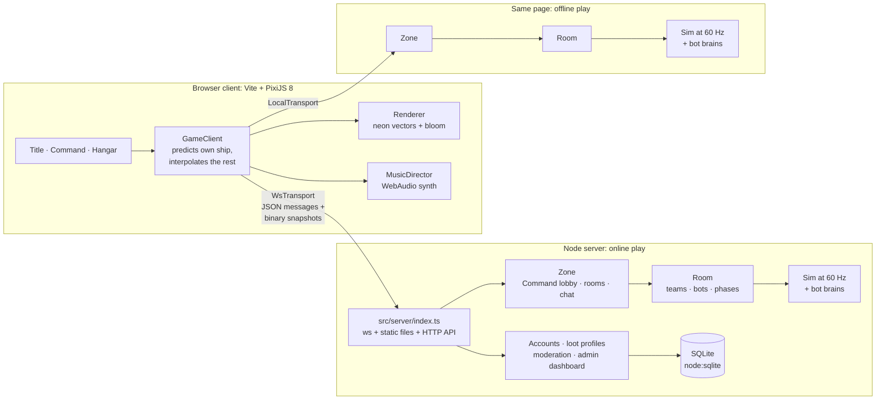

- **Authoritative server.** Clients send only inputs, and the server steps the `Sim` at 60 Hz. Online, each client gets a binary snapshot at 20 Hz, with positions quantized to uint16 at 1/8 px and interest management by distance. Offline, snapshots are passed as objects every tick.
- **Deterministic sim.** Maps are never sent. Both sides rebuild them from the seed (`buildMatchMap`), including every rift floor, so the shared sim uses its own seeded `Rng` and never `Math.random`.
- **Client prediction.** The client predicts its own ship, replaying unacknowledged inputs, and draws everyone else about 100 ms behind.

| Folder | What lives there |
|---|---|
| `src/shared/` | Pure TypeScript that runs in Node **and** the browser, with no DOM and no Node APIs. |
| ├ `sim/` | The deterministic simulation: movement, combat, skills, deployables, map and floor generation, the dungeon, objectives, `pve/` (swarm, XP, cards) and loot drops. |
| ├ `ai/` | Bot brains: navigation, dogfighting, objectives and rift goals. |
| ├ `room/` | `Zone` (connections, Command, rooms), `Room` (one room's players, teams, bots and matches), house rooms and the moderation seam. |
| ├ `net/` | The binary snapshot codec and message validation. |
| ├ `data/` | The canon catalogs: `ships.ts`, `gameTypes.ts`, `cosmetics.ts` and `loot.ts`. |
| └ `profile/`, `moderation/` | Loot profiles, grant rolls and the word filter. |
| `src/client/` | UI screens, input (keyboard, mouse and gamepad), `render/` (PixiJS 8 + pixi-filters bloom), `audio/` (sound effects and `music/`), the `title/` attract scene, and net transports. |
| `src/server/` | The `ws` game server and static hosting, `auth/` (accounts, scrypt, SMTP), `profile/` (SQLite profile store and loot ledger) and `moderation/` (chat log, bans, `/admin`). |

**[ARCHITECTURE.md](ARCHITECTURE.md) is canon**: the frozen contract, module ownership, the wire format and the full game design.

<p align="center"></p>

## Development

You need **Node 24** (the version CI uses).

```bash
npm install
npm run dev          # http://localhost:5173 → "Play offline vs bots" needs no server
```

For multiplayer:

```bash
npm run server       # game server + accounts API on ws://localhost:7777 (watch mode)
npm run dev          # then "Continue as guest" (or log in) in two browser tabs
```

| Script | What it does |
|---|---|
| `npm run dev` | Vite dev client on :5173. |
| `npm run server` | `ws` game server + accounts API on :7777, in watch mode. |
| `npm run build` · `npm start` | Build the client, then serve it with the ws server and API on :7777. |
| `npm run build:pages` · `npm run preview:pages` | Pages build (base `/voidswarm/`) and a local preview on :4173. |
| `npm run typecheck` | `tsc --noEmit`. |
| `npm test` | Vitest: 1556 tests in 87 files. |
| `npm run smoke` | A headless 60 s bot match. |
| `npm run mod -- <cmd>` | The moderation CLI (see [docs/MODERATION.md](docs/MODERATION.md)). |

<details>
<summary><b>Smoke runs and AI gates</b></summary>

```bash
# Objective AI-parity gates: CTF, Zones, Hot Point, Warzone Zones (16 bots, 5 sim-min)
npm run smoke -- --mode all
npm run smoke -- --mode hotpoint --ffa

# A 180 s bot rift on the Room path (floor reached, drop-in, /end abandon), then a whole cleared 3-floor run
npm run smoke -- --rift
npm run smoke -- --rift 700 --floors 3 --no-dropin

# The objective gates on the real Sim (plus the Arena DM PvP rate), and the rift gate:
# 4 normal bots clear floor 1 of seed 1234 in ≤ 6 sim-min
npm test -- src/shared/ai/objectiveParity.test.ts
npm test -- src/shared/ai/riftParity.test.ts
```

</details>

<details>
<summary><b>Ground rules for contributors</b></summary>

- **The contract.** [ARCHITECTURE.md](ARCHITECTURE.md) holds the frozen contract and module ownership. Changing a frozen file (`src/shared/{types,protocol,constants,version}.ts`, `sim/world.ts`, the shapes in `data/`, …) means updating it.
- **Determinism.** The sim must be deterministic given the seed: use `Rng`, never `Math.random`, anywhere in `src/shared/sim`.
- **Shared code.** `src/shared` must not touch the DOM or Node APIs.
- **Map size.** Keep `MAP_SIZE` under 8192, because coordinates go over the wire as uint16 at 1/8 px.
- **Versions.** The version lives only in `package.json`. Bump `PROTOCOL_VERSION` in `src/shared/version.ts` on any wire change.
- **Never commit** `data/` (account and profile databases), `dist/` or `node_modules/`.
- **On Windows,** don't write files with PowerShell 5.1 `Set-Content` / `Out-File`: the BOM they add breaks `package.json` for Vite.

</details>

<p align="center"></p>

## Roadmap

**Shipped**
- **v0.2:** three classes with build paths and talents, turret kits and laser resonance, deployables, and accounts.
- **v0.3:** Dungeon Runner, Arena and Warzone; the Command screen; cosmetic loot, profiles and the Hangar; the adaptive soundtrack.
- **v0.4.0** *(current)*: chat moderation. It adds the word filter, chat log, strikes, bans and mutes, `/report`, and the `/admin` dashboard and CLI.

**Next.** The contract already reserves slots for these, but none of them is playable yet, and none is promised.
- **Escort** (Arena): push the payload through 3 checkpoints, then defend it. Two rounds, stopwatch scoring.
- **Rival Rift** (Dungeon Runner): two parties race the same rift and can shoot each other.
- **Deeper rifts:** the Warden and Leviathan bosses, the Void biome, 9-floor runs, shrines, champion affixes and downed/rescue.
- **Crafting and salvage:** spend the shards you've been banking.
- **More cosmetics:** tracer and decal slots, animated accents and rotating featured draws.
- **Warzone:** Hot Point in Warzone, an infestation drain and Hive spawns on the point.
- **Quality of life:** a reconnect grace window, catch-up XP and an `/end` vote.

<p align="center"></p>

## Credits & inspiration

Voidswarm is an original fan-made game. Its code, art, names and music are all its own. It borrows ideas, not assets, from:

- **SubSpace / Continuum:** Newtonian ships, energy as both health and ammo, bounties, and attaching to teammates as turrets.
- **Geometry Wars:** neon swarms and a grid that warps under fire.
- **Vampire Survivors:** XP gems, pick-1-of-3 level-ups and auto-weapons.
- **Diablo:** classes, skills, build paths, talents and loot rarities.
- **Vince DiCola's 80s film scores** and synthwave art: the sound and look of the soundtrack and the title screen.

Voidswarm is not affiliated with, endorsed by or connected to the makers or rights holders of any of these works. Their names appear here only to credit the inspiration.
